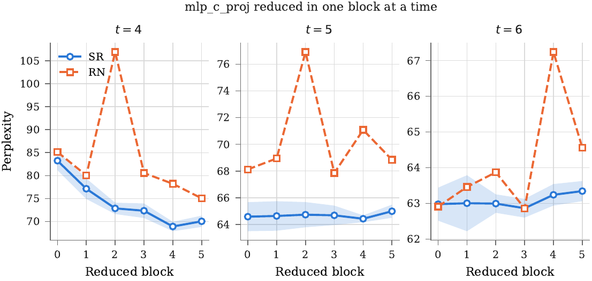
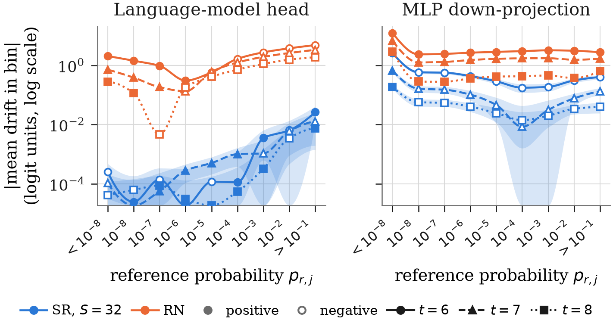
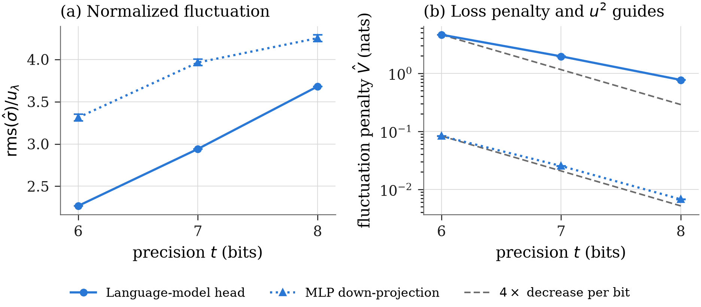
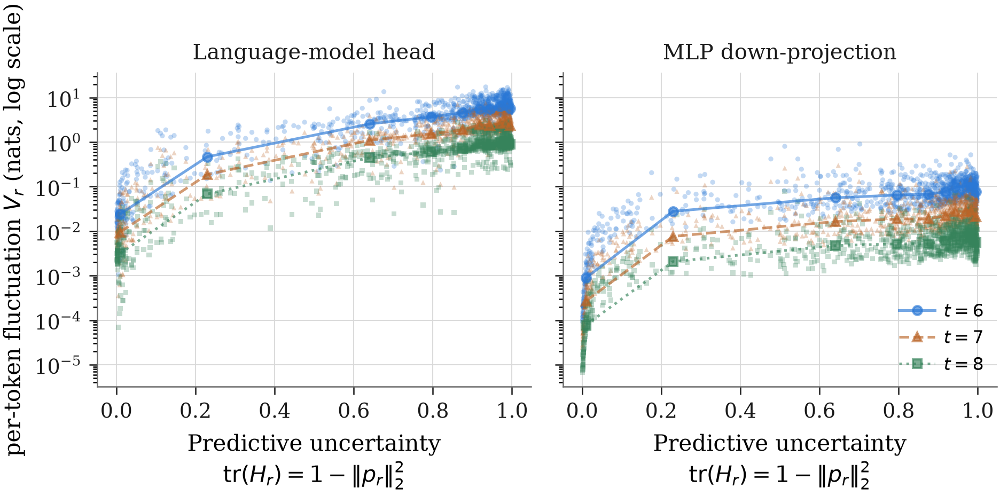

# Supplementary Material: Extended Experimental Tables and Statistical Diagnostics

This document provides supplementary numerical tables, diagnostic breakdowns, and extended evaluations for the paper:  
**"Stochastic Rounding in Low-Precision Transformer Inference: A Variable-Precision Emulation Study of a Small GPT-2"**

---

## Table of Contents
1. [Per-Component and Cumulative Propagation Tables](#1-per-component-and-cumulative-propagation-tables)
   - [Table S1: Per-Component Perplexity Sweep](#table-s1-per-component-perplexity-sweep)
   - [Table S2: Cumulative Propagation Across Transformer Blocks](#table-s2-cumulative-propagation-across-transformer-blocks)
2. [Blockwise Depth Sensitivity Analysis](#2-blockwise-depth-sensitivity-analysis)
   - [Figure S1: Blockwise Depth Sensitivity](#2-blockwise-depth-sensitivity-analysis)
3. [Fine-Grained Logit Drift and Fluctuation Diagnostics](#3-fine-grained-logit-drift-and-fluctuation-diagnostics)
   - [Table S3: Marginals of Logit Perturbations](#table-s3-marginals-of-logit-perturbations)
   - [Logit Drift Across Vocabulary Probability Bins (Figure S2)](#logit-drift-across-vocabulary-probability-bins)
   - [Fluctuation Scaling and Tail Diagnostics (Figure S3)](#fluctuation-scaling-and-tail-diagnostics)
   - [Fluctuation Cost and Predictive Uncertainty (Figure S4)](#fluctuation-cost-and-predictive-uncertainty)

---

## 1. Per-Component and Cumulative Propagation Tables

These tables provide the complete numerical estimates corresponding to the graphical sweeps presented in Section 6 of the main text. Evaluations use DistilGPT-2 on the first 1024 tokens of the WikiText-2 test set (1020 scored positions), with full-precision reference ($t=24$, RN) perplexity of **62.51**.

### Table S1: Per-Component Perplexity Sweep
Each entry reports sample mean $\pm$ standard deviation over 5 independent seeds for SR; RN is deterministic. Here $\Delta = \overline{\text{SR}} - \text{RN}$, where negative values favor SR and positive values favor RN. All non-target operations remain at $t=24$ under RN.

| Component | Rule | $t=4$ | $t=5$ | $t=6$ | $t=7$ | $t=8$ | $t=9$ |
| :--- | :--- | :---: | :---: | :---: | :---: | :---: | :---: |
| **`attention`** (All attention ops) | SR | $619 \pm 39$ | $103.87 \pm 1.56$ | $70.50 \pm 1.84$ | $64.60 \pm 0.49$ | $62.82 \pm 0.22$ | $62.47 \pm 0.10$ |
| | RN | $806$ | $136.50$ | $74.96$ | $63.42$ | $62.47$ | $62.17$ |
| | $\Delta$ | **-187** | **-32.63** | **-4.46** | **+1.18** | **+0.35** | **+0.30** |
| **`attn_qkav`** ($QK^\top$ and $AV$ only) | SR | $71.26 \pm 1.26$ | $64.30 \pm 0.72$ | $62.71 \pm 0.31$ | $62.44 \pm 0.25$ | $62.50 \pm 0.13$ | $62.48 \pm 0.02$ |
| | RN | $65.90$ | $64.03$ | $63.39$ | $62.56$ | $62.45$ | $62.49$ |
| | $\Delta$ | **+5.36** | $+0.27$ | **-0.68** | $-0.12$ | $+0.05$ | $-0.01$ |
| **`mlp`** (All feedforward ops) | SR | $2239 \pm 177$ | $175.65 \pm 7.87$ | $71.97 \pm 1.16$ | $64.62 \pm 0.86$ | $62.69 \pm 0.42$ | $62.58 \pm 0.18$ |
| | RN | $9397$ | $2029.83$ | $137.93$ | $71.27$ | $63.75$ | $62.74$ |
| | $\Delta$ | **-7158** | **-1854** | **-65.96** | **-6.65** | **-1.06** | $-0.16$ |
| **`lm_head`** (Vocabulary projection) | SR | $(2.01 \pm 0.73)\times 10^9$ | $(7.05 \pm 0.81)\times 10^5$ | $5054 \pm 464$ | $425.80 \pm 19.03$ | $135.56 \pm 5.22$ | $80.76 \pm 1.78$ |
| | RN | $1.05 \times 10^4$ | $2300$ | $519.18$ | $174.73$ | $93.60$ | $70.46$ |
| | $\Delta$ | **+$2.01\times 10^9$** | **+$7.03\times 10^5$** | **+4535** | **+251.07** | **+41.96** | **+10.30** |

*Note*: Bold $\Delta$ denotes differences statistically resolved at the 95% level (Student-$t$, $df=4$). At $t=10$ and $t=11$, `lm_head` remains RN-favorable ($\Delta = +4.07$ and $+0.90$); all components converge within $0.02$ points of baseline by $t=14$.

---

### Table S2: Cumulative Propagation Across Transformer Blocks
Perplexity when the feedforward down-projection (`mlp_c_proj`, $n=3072$) is reduced to precision $t \in \{4, 5, 6\}$ across prefix blocks $0$ through $k$, while holding all other operations at $t=24$ under RN.

| Precision | Rule | Block 0 | Blocks 0–1 | Blocks 0–2 | Blocks 0–3 | Blocks 0–4 | Blocks 0–5 |
| :--- | :--- | :---: | :---: | :---: | :---: | :---: | :---: |
| **$t=4$** | SR | $83.24 \pm 2.08$ | $174.50 \pm 8.21$ | $244.18 \pm 19.56$ | $334.89 \pm 14.80$ | $402.52 \pm 40.13$ | $461.02 \pm 20.13$ |
| | RN | $85.13$ | $220.20$ | $487.27$ | $841.03$ | $1499.15$ | $1934.17$ |
| | $\Delta$ | $-1.89$ | **-45.70** | **-243.09** | **-506.14** | **-1096.63** | **-1473.15** |
| **$t=5$** | SR | $64.58 \pm 1.09$ | $69.22 \pm 1.62$ | $73.26 \pm 1.28$ | $77.75 \pm 1.13$ | $83.14 \pm 0.74$ | $85.43 \pm 2.14$ |
| | RN | $68.12$ | $75.54$ | $129.37$ | $160.51$ | $204.31$ | $250.00$ |
| | $\Delta$ | **-3.54** | **-6.32** | **-56.11** | **-82.76** | **-121.17** | **-164.57** |
| **$t=6$** | SR | $62.98 \pm 0.46$ | $63.25 \pm 0.89$ | $63.80 \pm 0.78$ | $64.75 \pm 1.24$ | $65.84 \pm 0.43$ | $66.24 \pm 0.63$ |
| | RN | $62.91$ | $63.17$ | $65.41$ | $67.34$ | $74.63$ | $79.64$ |
| | $\Delta$ | $+0.07$ | $+0.08$ | **-1.61** | **-2.59** | **-8.79** | **-13.40** |

---

## 2. Blockwise Depth Sensitivity Analysis

When reducing precision in an individual block at a time (holding all other blocks at $t=24$), sensitivity to arithmetic rounding varies non-monotonically across transformer layers:

* **Non-monotonic vulnerability**: Neither SR nor RN exhibits a monotonic degradation with layer depth. Intermediate layers can incur greater perplexity spikes than early or late layers.
* **Rule disagreement**: The two rounding rules disagree on which individual block is the most critical:
  * Under RN, later blocks (particularly blocks 3 and 4) often exhibit the highest sensitivity due to deterministic drift compounding through remaining non-linear activations.
  * Under SR, early blocks can inject stochastic variance that propagates through downstream layers, shifting the vulnerability profile.
* **Implication**: Optimal precision and rounding allocation cannot be inferred from simple static depth heuristics (e.g., "earlier layers need higher precision"), motivating fine-grained profiling.

**Figure S1:** Blockwise sensitivity — `mlp_c_proj` reduced in an individual block at a time (all other operations held at $t=24$). Sensitivity varies non-monotonically with depth for both rules, and the two rules disagree on which block is most vulnerable.

---

## 3. Fine-Grained Logit Drift and Fluctuation Diagnostics

### Table S3: Marginals of Logit Perturbations
Order statistics and sample moments of logit perturbations across all $N \times V = 1020 \times 50257 = 51{,}262{,}140$ token–coordinate pairs, evaluated with $S=32$ independent SR seeds and one deterministic RN run.

#### (a) Vocabulary Projection (`lm_head`, $n=768$)

| Rule | $t$ | Median | Mean | RMS | Max $\lvert\cdot\rvert$ | $\mathrm{rms}(\hat{\sigma})$ | $t_{\mathrm{stat}}$ (Mean vs. 0) |
| :---: | :---: | :---: | :---: | :---: | :---: | :---: | :---: |
| SR | 4 | 0.0189 | $-0.00033 \pm 0.00026$ | 1.695 | 13.68 | 9.590 | -1.26 |
| SR | 5 | 0.0080 | $-0.00040 \pm 0.00017$ | 1.135 | 8.83 | 6.422 | **-2.32** |
| SR | 6 | 0.0033 | $-0.00011 \pm 0.00009$ | 0.754 | 6.12 | 4.267 | -1.23 |
| SR | 7 | 0.0014 | $+0.00004 \pm 0.00007$ | 0.489 | 3.65 | 2.767 | +0.53 |
| SR | 8 | 0.0005 | $-0.00001 \pm 0.00004$ | 0.306 | 2.37 | 1.732 | -0.16 |
| RN | 4 | 3.0961 | 3.1774 | 4.756 | 31.50 | — | — |
| RN | 5 | 2.2595 | 2.3742 | 3.595 | 26.07 | — | — |
| RN | 6 | 1.1720 | 1.2781 | 2.388 | 18.07 | — | — |
| RN | 7 | 0.2895 | 0.3300 | 1.463 | 12.11 | — | — |
| RN | 8 | 0.0500 | 0.0764 | 0.988 | 9.71 | — | — |

#### (b) Feedforward Down-Projection (`mlp_c_proj`, $n=3072$)

| Rule | $t$ | Median | Mean | RMS | Max $\lvert\cdot\rvert$ | $\mathrm{rms}(\hat{\sigma})$ | $t_{\mathrm{stat}}$ (Mean vs. 0) |
| :---: | :---: | :---: | :---: | :---: | :---: | :---: | :---: |
| SR | 4 | 5.2278 | $+3.5422 \pm 0.1381$ | 16.168 | 85.55 | 8.939 | **+25.65** |
| SR | 5 | 0.3517 | $+1.2114 \pm 0.1160$ | 13.456 | 78.78 | 7.898 | **+10.44** |
| SR | 6 | 0.1225 | $+0.5527 \pm 0.0626$ | 5.026 | 30.46 | 6.234 | **+8.83** |
| SR | 7 | 0.0485 | $+0.1385 \pm 0.0386$ | 1.580 | 10.66 | 3.730 | **+3.58** |
| SR | 8 | 0.0023 | $+0.0326 \pm 0.0155$ | 0.531 | 4.82 | 2.001 | **+2.10** |
| RN | 4 | 19.6268 | 17.8983 | 25.948 | 112.22 | — | — |
| RN | 5 | 6.9790 | 6.1780 | 17.705 | 119.62 | — | — |
| RN | 6 | 4.1844 | 5.8902 | 16.559 | 99.40 | — | — |
| RN | 7 | 2.0568 | 3.1865 | 9.461 | 62.60 | — | — |
| RN | 8 | 0.5754 | 1.2144 | 4.565 | 35.93 | — | — |

*Key Insights*:
1. At the head, SR's mean drift is statistically unresolved from zero across nearly all precisions, while RN accumulates a significant positive drift.
2. At the MLP down-projection, SR's pooled sample mean is positive and statistically resolved, but almost entirely represents a **common-mode per-token logit shift** (RMS $5.022$ per token vs. $5.026$ per logit), which the softmax completely discards by shift invariance.

---

### Logit Drift Across Vocabulary Probability Bins
Evaluating drift as a function of the reference predictive probability $p_j$ reveals why aggregate pooled means can differ in sign from the loss-weighted drift $D = (p - e_y)^\top b$:
* Under RN at $t=6$, drift varies monotonically with reference probability, from $+2.04$ logits for classes with $p < 10^{-8}$ to $-4.79$ logits for classes with $p > 10^{-1}$ (a swing of nearly 7 logits).
* Under SR at `mlp_c_proj`, the positive pooled mean ($+0.553$) is dominated by the $34.9\%$ of vocabulary coordinates below $p < 10^{-8}$ (which hold only $0.004\%$ of probability mass). Every bin where the softmax places meaningful probability mass has a negative mean drift ($-0.58$ to $-0.40$), aligning with the negative signed loss term $D$.

**Figure S2:** Expected per-logit drift across reference probability bins at $t=6,7,8$ ($S=32$ seeds). Both panels share a logarithmic axis of $\lvert\text{mean drift}\rvert$; marker fill carries the sign (filled = positive, hollow = negative). Shaded envelopes denote $\pm 1$ standard error over seeds. The dashed line marks the empirical reference-logit scale $u_\lambda = 2^{1-t}\,\mathrm{rms}(\lambda)$; points within the gray band fall below that scale. Under RN, perturbations shift monotonically from positive on rare tokens to negative on likely tokens. Under SR, high-probability bins exhibit negative drift at `mlp_c_proj` and near-zero drift at `lm_head`.

---

### Fluctuation Scaling and Tail Diagnostics
* **$u^2$ Scaling Behavior**: On a log scale, the measured fluctuation penalty $\hat{V}_{\text{SR}}$ decreases by approximately $2.4\times$--$2.5\times$ per bit over $t \in [6, 8]$. While somewhat shallower than the theoretical unpropagated $4\times$ ($u^2$) rate, it confirms steady quadratic variance decay.
* **Tail Behavior**: Standardized coordinate scores $z = (\xi_j - \bar{\xi}) / \hat{\sigma}_j$ have an empirical maximum of $4.96$ (bounded by the sample cap of $5.48$ for $S=32$). Token-pooled excess kurtosis ranges between $0.09$ and $0.35$, indicating that propagated SR noise exhibits mild leptokurtic tails relative to a pure Gaussian.

**Figure S3:** SR fluctuation over $t=6,7,8$ ($S=32$ seeds) with $\pm 1$ standard error. Left: RMS coordinate standard deviation normalized by $u_\lambda = 2^{1-t}\,\mathrm{rms}(\lambda)$; proportionality to $u$ corresponds to a horizontal line. Middle: empirical maximum standardized score $\max_{i,j} \lvert z_{i,j}\rvert$ across all $51{,}262{,}140$ entries ($1020 \times 50257$), with the sample cap $(S-1)/\sqrt{S}$ dashed. Right: token-pooled excess kurtosis of standardized scores (Gaussian reference dashed at 0). Solid lines in the middle and right panels are visual guides to $t$-independent scaling.

---

### Fluctuation Cost and Predictive Uncertainty
We measure predictive uncertainty per token by the trace of the Fisher matrix $\mathrm{tr}(H_r) = 1 - \|p_r\|_2^2 \in [0, 1)$.
* Across $N=1020$ scored positions at $t=6,7,8$, the per-token fluctuation penalty $V_r$ correlates positively with $\mathrm{tr}(H_r)$ ($r = 0.67$--$0.72$ at `lm_head`; $r = 0.34$--$0.40$ at `mlp_c_proj`).
* When the reference model is uncertain (entropy is high, probability mass is spread across multiple competing tokens), the trace of the Fisher metric increases, causing random SR fluctuations between classes to inflict higher cross-entropy penalties.

**Figure S4:** Per-token fluctuation penalty $V_r$ against predictive uncertainty $\mathrm{tr}(H_r) = 1 - \|p_r\|_2^2$ ($S=32$ seeds). Points represent all $1020$ scored positions at $t \in \{6,7,8\}$; lines show the median $V_r$ within each decile of $\mathrm{tr}(H_r)$. In higher-entropy contexts where probability mass is dispersed across multiple candidate tokens, random stochastic fluctuations incur larger cross-entropy penalties.
